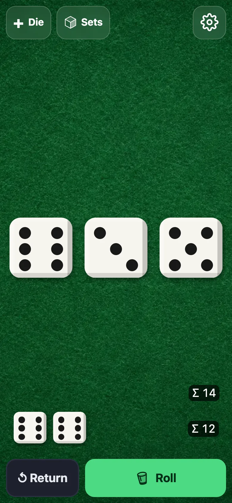
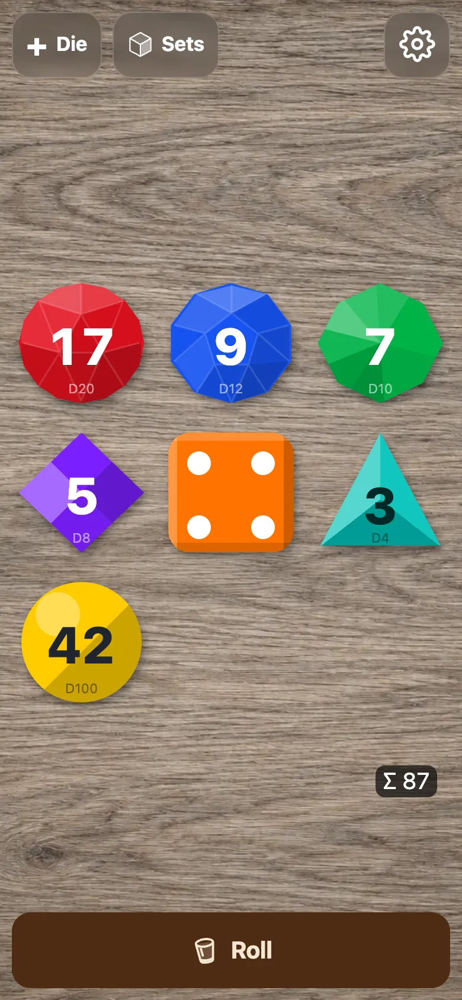
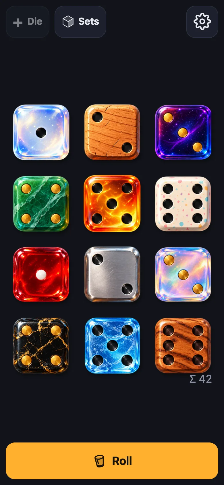
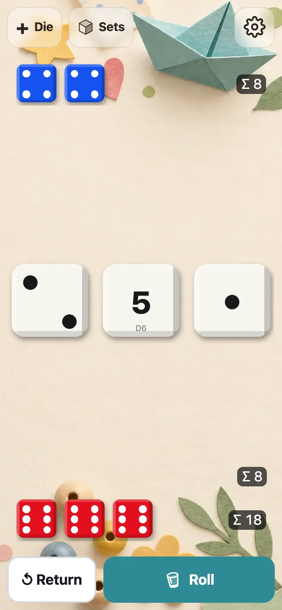
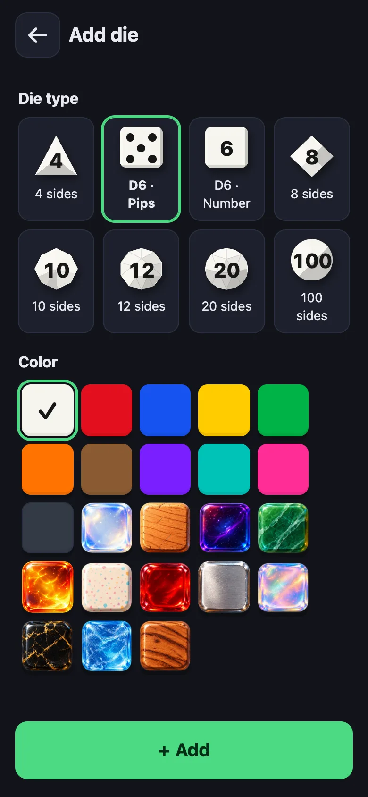
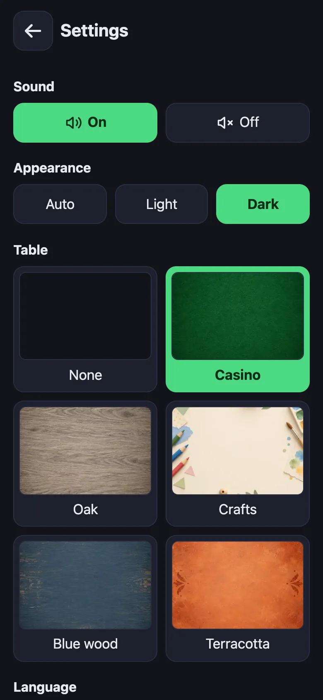

# HandyDice

**Roll dice on your phone. No ads, no tracking, no sign-up, no catch.**

👉 **[handydice.github.io](https://handydice.github.io)**: open it, tap Roll, done. Add it to your home screen and it
works like an app, offline too.

<p align="center">
  
  
  
  
</p>

## Why another dice app?

Search for "dice" in any app store and you get hundreds of results. Most show you a banner ad after every roll, want
a subscription for a second color or ask for permissions a dice roller has no business asking for. HandyDice is
the one we wanted for our own game nights:

- **Free, for real.** No ads, no in-app purchases, no premium tier. MIT licensed.
- **Private.** No accounts, no analytics, no trackers, no cookies. Your dice and settings stay on your device.
- **Offline.** Once loaded, it works without a connection, at the cabin or on the train.
- **Fair rolls.** The Roll button and shake-to-roll use the browser's cryptographic random generator,
  with rejection sampling and uniformly randomized 3D face numbering.
- **Nothing to install.** It's a web app: one link for iPhone, Android and desktop. Installing to the home screen
  is optional and takes two taps.
- **No dependencies.** Plain JavaScript and CSS, no framework and no build step.

## What it does

- **Up to 12 dice:** D4, D6 (pips or numbers), D8, D10, D12, D20 and D100.
- **Two trays** to set dice aside between rolls, like Yahtzee or Farkle at the table. Only the dice left on the
  table are rerolled, and every tray shows its own total.
- **Ready-made sets** for Yahtzee, That's Pretty Clever, Clever³, roleplaying (D4–D20) and percentile dice.
  Save your own with one tap.
- **12 painted skins** (opal, galaxy, jade, amber, steel, ice, …) plus 11 plain colors, per die.
- **5 table surfaces:** casino felt, oak, crafts, blue wood, terracotta. Light, dark or automatic theme.
- **Feels like real dice:** a dice cup animation with sound, or spinning dice. Shake your phone to roll.
- **2D or 3D:** lightweight 2D by default, or physical 3D dice selected in Settings. Switching keeps your round.
- **Accessible:** full keyboard control, an optional two-tap mode instead of dragging, respects reduced motion.
- **8 languages:** English, German, French, Spanish, Portuguese (Brazil), Italian, Dutch and Polish, following
  your browser or chosen manually.
- **Remembers your round:** dice, trays, sets and the last 30 results survive a reload.

<p align="center">
  
  
</p>

## 2D and 3D

Settings → **Dice display** switches between the original 2D view and physical 3D dice. 2D never
initializes WebGL; switching back to it stops the simulation and releases the 3D graphics resources.
3D requires WebGL2. Both views share dice, trays, colors, sets, history and other settings.

In 3D, drag to pick up and release to drop. Shift-drag, a second finger, or Shift + arrow keys rotate
a picked-up die. Touch drops keep the current numbering: their result is physical, not guaranteed
uniform. Moving a die into a tray preserves its stored value; taps and keyboard returns choose
free table positions, while a pointer drop respects the chosen position.

The Roll button and shaking assign fresh cryptographic numbering **before** each 3D throw.
Opposite-number pairs are shuffled and independently flipped, making every physical face uniform
over all numbers even if the geometry or simulation favors some faces. Opposite sums remain correct;
D4 corner labels follow the mapping too. Nothing changes the result after landing. 2D draws values
directly with the same unbiased cryptographic generator.

## Install

- **iPhone / iPad:** open the link in Safari → Share → *Add to Home Screen*.
- **Android:** open the link in Chrome → *Install app* (in the settings screen or the browser menu).
- **Desktop:** Chrome and Edge show an install icon in the address bar. Or just keep the tab.

## Development

Any static file server works:

```sh
python3 -m http.server 8000
```

Then open http://localhost:8000. The service worker needs `localhost` or HTTPS.

```sh
npm test   # = node --test, runs every *.test.mjs
```

Touch smoke check: tap the Roll button, then hold it for 1–3 seconds and release. Each action must add
exactly one history entry. Enter and Space must still roll; a canceled touch or dropping a die onto
the Roll button must not. The button uses pointer release because mobile long presses can suppress clicks.

| File | Responsibility |
| --- | --- |
| `index.html` | Markup in English (source language), inline theme script to avoid a flash |
| `app.js` | UI wiring: rendering, tap/drag/keyboard input, roll animation, dialogs, settings, shake |
| `dice.js` | Pure dice rules: unbiased rolls, trays, table slots |
| `dice3d.js` | Rounded polyhedral geometry, face labels and physical face reading |
| `physics3d.js` | Gravity, rigid-body contacts, pickup and sleeping |
| `renderer3d.js` | Native WebGL2 dice, mapped labels, skins, overlapping shadows and exact picking |
| `scene3d.js` | On-demand simulation, value-preserving trays, free-space returns and GPU lifetime |
| `state.js` | Load and validate saved state; storage keys |
| `i18n.js` | Language choice, translations, DOM localization |
| `layout.js` | Largest dice size that fits the table |
| `sound.js` | Preloaded Web Audio effects |
| `viewport.js` | App height, including the iOS PWA full-screen workaround |
| `sw.js` | Service worker: network first, precached offline fallback |

Dice rules, geometry, physics, tray transitions, saved state, 2D layout and language choice are tested
with `node:assert`. Tests also check all translations and service-worker precaching. Browser smoke:
switch 2D → 3D → 2D without changing the round; rotate a picked-up die and store it without changing
its value; return several tray dice without overlap; reload and switch views offline.

New language: add its code to `LANGUAGES`, a table to `translations` in `i18n.js`, a
`manifest.<code>.webmanifest`, and a button in `#language` (`index.html`).

### Release

1. Bump `CACHE` in `sw.js`; add new files to `ASSETS` (the tests fail if one is missing).
2. Push to `main`: GitHub Actions runs the tests and publishes to GitHub Pages (`.github/workflows/pages.yml`).

## License

[MIT](LICENSE). Contributions and translations welcome.
